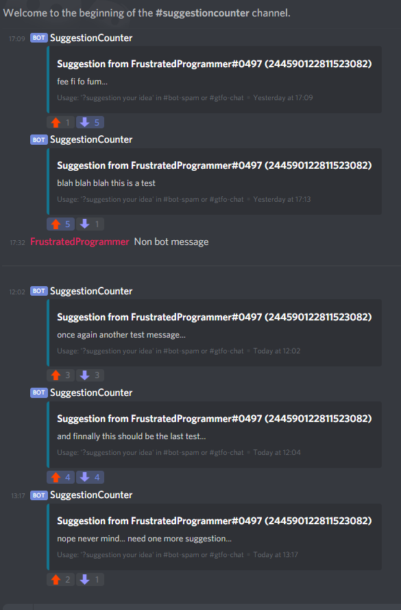
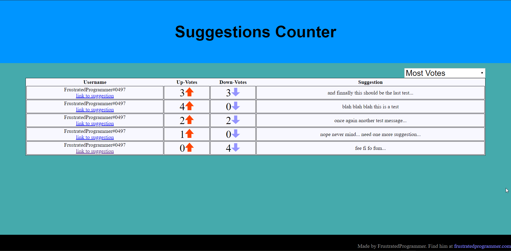

# Suggestion Collection
This bot is a bot that sorts through all the suggestion in a given channel and turns it into a fancy HTML page. Made specifically for the GTFO discord.
<br><span>*So it turns these discord messages into this fancy HTML page.*</span><br><span></span>

# Set up
1. Invite your bot that will run the code to the server. *Make sure the bot has the following perms*
  <br>\- Read Messages
  <br>\- Read Message History
2. Modify the config.json so the following values are set
  ```
  token                 | Token of the bot.
  debug                 | Whether you wish the bot to log data as it sorts through messages. 
  channel               | The ID of the channel you wish to gather suggestions from.
  upVoteEmoji           | The ID of the emoji that counts as an UP vote.
  downVoteEmoji         | The ID of the emoji that counts as a DOWN vote.
  tieGracePercent       | The percentage of grace for a message's reactions to count as a tie.
  validSuggestion       | What classifies a message as a valid suggestion. Valid values are: "bot", "<insert id of message sender>" "anyone"
  maxSuggestionsPerPage | How many suggestions to allow on a page. Set to 0 for no limit.
  ownerIDs              | The array of IDs that the bot will respond to.
  updateHours           | How many hours need to pass before the bot tries to update the HTML pages again. Use "false" to disable auto updates.
  ```
3. Run the code. Any questions email me at contact@frustratedprogrammer.com

### Editing the base.html
It's simple to edit the html. All you need todo is make sure you have the following text *exactly*: `<!-- Divider -->`*. This must be somewhere inside of a `<table></table>` tag, as what my bot does is replaces that text with the data from the suggestions.

